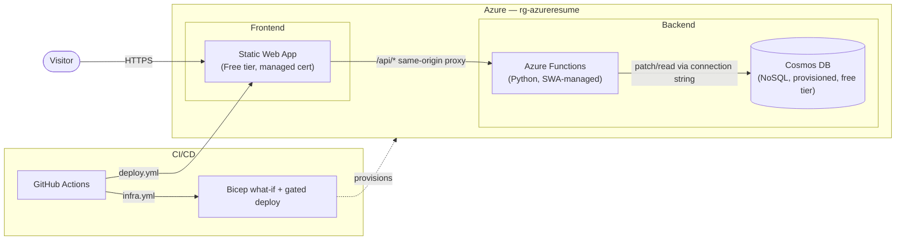

# Azure Resume

A personal resume/portfolio site that doubles as a hands-on cloud and security engineering case study. It integrates Azure Static Web Apps, Azure Functions, and Cosmos DB behind a serverless Python API, with every resource defined as Bicep Infrastructure-as-Code and deployed through a GitHub Actions CI/CD pipeline. The build is as much about the decisions as the demo: documenting a real cost-vs-security trade-off (see [Why these choices](#why-these-choices)) rather than defaulting to the most expensive, most locked-down option available.

**Live site:** _not deployed yet_
**Status:** in progress — infrastructure is live in Azure; frontend/API code deployment and CI/CD are next.

---

## Features

- **Static Website Hosting** — the resume site is deployed to Azure Static Web Apps (Free tier), which provides global distribution and a free managed HTTPS certificate with no separate CDN or certificate resource needed.
- **Visitor Tracking** — a serverless backend (Azure Functions, Python + Cosmos DB) tracks and serves a live visitor count via `GET /api/count`.
- **Infrastructure as Code** — Bicep provisions and manages every Azure resource; nothing was created through the Portal. Deployed and verified against a live resource group.
- **Secret-Free by Design** — the Cosmos DB connection string is resolved live at deploy time and injected directly into the Function App's settings. It never exists in git, a GitHub secret, or a parameter file.
- **CI/CD Pipeline** _(in progress)_ — GitHub Actions will deploy the frontend and API together on push to `main`, plus a gated Bicep pipeline for infrastructure changes.

## Architecture



The connection string flowing from Cosmos DB into the Function is resolved live by Bicep at deploy time (`listConnectionStrings()`) — it's never stored in a GitHub secret, a parameter file, or git history. See [Why these choices](#why-these-choices) for the full reasoning.

| Layer | Choice |
|---|---|
| Frontend | Static HTML/CSS/vanilla JS, no framework |
| Hosting | Azure Static Web Apps — Free tier, managed Functions (no separate Function App resource) |
| API | Python, Azure Functions v2 programming model |
| Database | Azure Cosmos DB (NoSQL API), provisioned throughput with `enableFreeTier: true` |
| IaC | Bicep |
| CI/CD | GitHub Actions — one workflow deploys frontend + API together, a second handles Bicep `what-if`/deploy |

**Budget:** targeting ~$20-25/year, essentially all of it just custom domain registration.

## Why these choices

- **SWA Free tier, not Standard.** Standard (~$9-12/mo) would allow a standalone Function App with managed identity authenticating to Cosmos via RBAC — zero keys anywhere. Free tier's managed-Functions model can't use managed identity at all (confirmed against Microsoft's own docs, not assumed) — a real platform limitation, not an oversight. Traded that off for a 4-6x cheaper budget: Bicep resolves the Cosmos connection string live via `listConnectionStrings()` straight into the Function App's settings, so it never touches a GitHub secret, a parameter file, or git history.
- **Cosmos provisioned throughput with `enableFreeTier: true`, not serverless.** The free tier (1000 RU/s + 25GB, genuinely $0) only applies to provisioned/autoscale accounts — serverless is cheap, not free.

## Project Structure

```
.
├── LICENSE
├── README.md
├── .github/
│   └── workflows/
│       ├── deploy.yml
│       └── infra.yml
├── infra/
│   ├── main.bicep
│   ├── main.bicepparam
│   └── modules/
│       ├── cosmos.bicep
│       ├── staticWebApp.bicep
│       └── monitoring.bicep
├── src/
│   ├── frontend/
│   │   ├── index.html
│   │   ├── css/styles.css
│   │   ├── js/counter.js
│   │   ├── favicon.svg
│   │   ├── robots.txt
│   │   └── staticwebapp.config.json
│   └── api/
│       ├── function_app.py
│       ├── requirements.txt
│       └── host.json
├── tests/
│   ├── conftest.py
│   ├── requirements.txt
│   └── api/
│       └── test_get_count.py
└── docs/
    ├── architecture.md
    └── decisions/
```

## Explanation of Directories and Files

- **`.github/workflows/`** — GitHub Actions definitions. `deploy.yml` deploys the frontend and Python API together; `infra.yml` runs a Bicep `what-if` diff on pull requests and a gated deploy on merge to `main`.
- **`infra/`** — Bicep IaC. `main.bicep` orchestrates the `cosmos.bicep` (account, database, container, free tier) and `staticWebApp.bicep` (Static Web App + the connection-string app setting) modules. `monitoring.bicep` is a Phase 2 stub, not yet wired in.
- **`src/frontend/`** — the static resume site: plain HTML/CSS/JS, no framework.
- **`src/api/`** — the Python Azure Functions API (`function_app.py`) that reads/increments the visitor counter.
- **`tests/`** — pytest unit tests for the API, with a mocked Cosmos client.
- **`docs/`** — architecture notes and decision records (in progress).

## Implementation Details

**1. Static Website Hosting**
Technology: Azure Static Web Apps (Free tier)
Deployed directly into the SWA resource, which provides global distribution and a free managed HTTPS certificate out of the box.

**2. Visitor Tracking**
Technology: Azure Functions (Python, SWA-managed), Cosmos DB
The frontend calls `/api/count` as a relative path, proxied same-origin through the Static Web App to the managed Function. The Function atomically increments a counter document in Cosmos DB and returns the current count.

**3. Infrastructure as Code**
Technology: Bicep
Every resource — the Cosmos DB account, database, container, and the Static Web App — is defined in Bicep and deployed via `az deployment group create`. No resource was created through the Portal.

**4. CI/CD Pipeline** _(in progress)_
Technology: GitHub Actions
One workflow deploys the frontend and API together on push to `main`; a second runs a Bicep `what-if` diff on pull requests and requires manual approval before deploying infrastructure changes.

**5. Secret Handling**
Technology: Bicep `listConnectionStrings()`
The Cosmos DB connection string is never stored anywhere — Bicep resolves it live at deploy time and writes it directly into the Static Web App's Function App settings. It doesn't appear in a GitHub secret, a `.bicepparam` file, or git history at any point.

## Running locally

**Frontend:**
```
cd src/frontend
python -m http.server 8080
```

**API tests:**
```
python -m venv .venv
.venv/Scripts/activate   # or source .venv/bin/activate on macOS/Linux
pip install -r tests/requirements.txt
pytest tests/
```

## Security considerations

- CORS is same-origin by design (the frontend calls `/api/*` as a relative path through the Static Web App's proxy), with an explicit origin lock as defense-in-depth.
- Infrastructure changes go through a `what-if` diff on every pull request and a manual approval gate before deploying to the live resource group.

## Future Improvements

- Add a custom domain (Free tier supports up to 2)
- Wire up Application Insights for monitoring
- Expand automated test coverage
- Publish the write-up blog post

## License

MIT — see [LICENSE](LICENSE).
