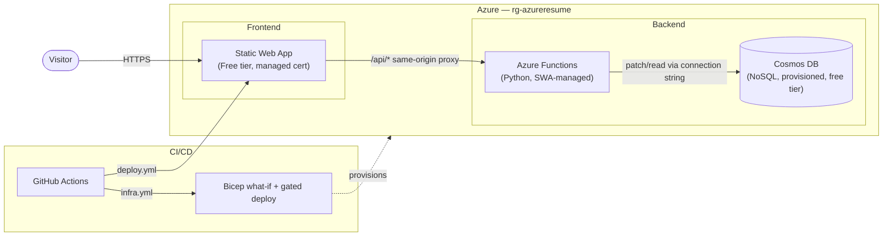

# Architecture

## Overview

A visitor's browser hits the Static Web App directly over HTTPS (Azure's free managed certificate, custom domain `josperdo.com`). The frontend is static HTML/CSS/vanilla JS — no framework, no build step. The one dynamic piece, `GET /api/count`, is requested as a relative path and proxied same-origin through SWA straight to the managed Python Function; the browser never makes a cross-origin request in normal operation (see [CORS locked down as defense-in-depth](#cors-locked-down-as-defense-in-depth) below).

## Request flow

1. Browser requests `josperdo.com` → served by the Static Web App (global CDN, free managed cert).
2. Page load fires `GET /api/count` (fire-and-forget — the count itself isn't displayed in the UI, see [Visitor count is real, but not displayed](#visitor-count-is-real-but-not-displayed)).
3. SWA's `/api/*` reverse proxy routes the request to the managed Azure Function (Python, Functions v2 model) — same origin, no CORS preflight needed.
4. The Function reads `COSMOS_CONNECTION_STRING` from its own app settings and issues an atomic `patch_item` increment against a single fixed document (`visitor-count`) in Cosmos DB.
5. Cosmos DB returns the updated count; the Function returns a small JSON response.

## Why these specific choices

### SWA Free tier + managed Functions, not Standard + BYOF

Standard tier (~$9-12/mo) would allow a standalone Function App with system-assigned managed identity authenticating to Cosmos via RBAC — zero keys anywhere. Free tier's managed-Functions model **cannot** use managed identity at all — confirmed against Microsoft's own SWA feature-comparison table (an explicit "✕", not an assumption), because the underlying Function App isn't exposed as a controllable ARM resource on Free tier. Traded that off for a ~4-6x cheaper budget: Bicep resolves the Cosmos connection string live via `listConnectionStrings()` straight into the Function App's settings at deploy time, so it never touches a GitHub secret, a parameter file, or git history.

### Cosmos DB: provisioned throughput with `enableFreeTier: true`, not serverless

Cosmos's genuinely-$0 free tier (1000 RU/s + 25GB) only applies to provisioned/autoscale accounts — serverless has no free allowance at all. Confirmed before building, not assumed.

### CORS locked down as defense-in-depth

The real call path is same-origin through the SWA proxy, so CORS never gates normal traffic. The Function's `Access-Control-Allow-Origin` header is still explicitly scoped to the real SWA hostname (via an `ALLOWED_ORIGIN` app setting, derived from the resource's own hostname in Bicep so it can't drift) rather than left as a wildcard — in case the API is ever called from a second frontend.

### Visitor count is real, but not displayed

The counter still fires on every page load and Cosmos DB still increments — the underlying Cloud Resume Challenge requirement (a working visitor counter) is fully implemented and live. The number itself was deliberately removed from the UI to avoid publicly exposing traffic volume; this is a UI/display choice, not a rollback of the counting mechanism.

### CI/CD: two workflows, one accepted static secret

`deploy.yml` (frontend + API, via the official `Azure/static-web-apps-deploy` action) and `infra.yml` (Bicep `what-if` on every PR touching `infra/**`, gated deploy on merge to `main`) run independently. `infra.yml` authenticates via GitHub OIDC federated credentials — no stored secret at all. `deploy.yml` requires one static `AZURE_STATIC_WEB_APPS_API_TOKEN` secret, because the SWA deploy action has no OIDC support as of this build (confirmed via an open upstream GitHub issue). Accepted as the one unavoidable static credential in the system, documented rather than hidden.

### Custom domain: apex validation via DNS TXT, not a bare CNAME

Apex/root domains (`josperdo.com`, not a subdomain) can't use a plain CNAME per DNS spec, and Azure Static Web Apps requires TXT-based domain-ownership validation for apex custom domains specifically (`az staticwebapp hostname set --validation-method dns-txt-token`). Once validated, traffic routing uses a CNAME at `@` (Cloudflare auto-flattens this at the apex). `www.josperdo.com` redirects to the apex via a Cloudflare Redirect Rule rather than being registered as a second Azure custom domain — simpler, avoids repeating the TXT validation dance for a domain that's just supposed to bounce to the real one.

## Known, accepted limitations

- Cosmos DB access uses a connection string, not managed identity — a deliberate, explainable cost/security trade-off, not an oversight. The key is account-wide (Cosmos has no container-scoped key), which is the specific thing that would change first at higher stakes.
- The CI/CD infra-deploy manual-approval gate (a GitHub Environment protection rule) was descoped: GitHub only allows required-reviewer rules on private repos with a paid plan, or for free on public repos. With a single contributor, the gate wasn't adding real protection, so the repo stayed private and the gate was dropped rather than paying for it.
- See `docs/decisions/` for the full architecture decision records behind these calls.
